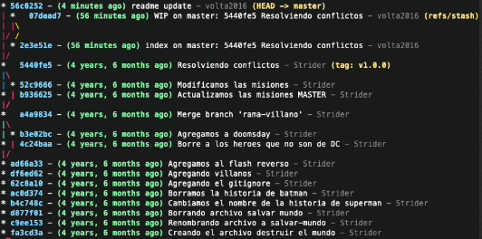

# Git stash

Me sale lo siguiente me dice que se salvo el directorio es decir todo los archivos que se le estaba dando seguimiento a git inclusive otros que ni siquiera git les da seguimiento pero graba todo por mi.

**git stash**

Saved working directory and index state WIP on master: 5440fe5 Resolviendo conflictos
Me dice que se salvo el directorio incluso todos los archivos incluso otros que git no le ha dado seguimiento, pero graba
todo mi working directory y lo indexo.

## WIP:

esto es working in progress en la rama master, luego pone un has o identificador que nos va servir como referencia.

damos git status y nos dice que estamos trabajando en un arbol limpio.

Esto ayudaria a que en este momento cualquier cosa que haya hecho ante del ultimo commit esta alamacenado en algún lugar
especial llamado el stash

**git stash list**

Puedo ver la referencias del stash voy a ver lo siguiente:

stash@{0}: WIP on master: 5440fe5 Resolviendo conflictos

aca vemos que tenemos 0 (que es la primera posición) pero podemos tener mas -> lo mas recomendable es tener solo un stash, lo stash igual pueden causar conflictos.

Agrego modificación en un archivo lo añado a al stage pero voy ver que paso con el stage

Notemos que creamos un stash y que tenemos ese identificador con WIP, esto asimila lo que es un stash resolviendo conflicto ahí esta la info que nosotros teniamos

Pero ya es momento de recuperar nuestro trabajo y hace las modificaciones en las misiones

Obviamente readme no choca con las misiones entonces perfectamente podemos recuperar nuestro trabajo muy fácilmente entonces si nosotros queremos tomar el ultimo stash

Aplicamos el siguiente cmd: esto va tomar el ultimo stash lo va dejar como lo tenia nuestro working directory, lo va dejar como estaba y va mantener los cambios que nosotros hicimos anteriormente

**git stash pop**

Trae los cambios y también borra ese stash.

git stash pop
On branch master
Changes not staged for commit:
(use "git add <file>..." to update what will be committed)
(use "git checkout -- <file>..." to discard changes in working directory)

    modified:   misiones.md

no changes added to commit (use "git add" and/or "git commit -a")
Dropped refs/stash@{0} (07dead7a1fe882d9b9db20c9542aafd72fed46c5)

Apareció que hay un archivo modificado de misiones.md y también dice que hizo el Drop boto el ese stash en la posición 0 si tienes 1 2 34 todo se corrieron hacia arriba el nuevo stash 0 va ser el que ante era el 1

- 56c0252 - (18 minutes ago) readme update - volta2016 (HEAD -> master)
- 5440fe5 - (4 years, 6 months ago) Resolviendo conflictos - Strider (tag: v1.0.0)
  |\
  | \* 52c9666 - (4 years, 6 months ago) Modificamos las misiones - Strider
- | b936625 - (4 years, 6 months ago) Actualizamos las misiones MASTER - Strider
  |/
- a4a9834 - (4 years, 6 months ago) Merge branch 'rama-villano' - Strider
  |\
  | \* b3e02bc - (4 years, 6 months ago) Agregamos a doomsday - Strider
- | 4c24baa - (4 years, 6 months ago) Borre a los heroes que no son de DC - Strider
  |/
- ad66a33 - (4 years, 6 months ago) Agregamos al flash reverso - Strider
- df6ed62 - (4 years, 6 months ago) Agregando villanos - Strider
- 62c8a10 - (4 years, 6 months ago) Agregando el gitignore - Strider
- ac0d374 - (4 years, 6 months ago) Borramos la historia de batman - Strider
- b4c748c - (4 years, 6 months ago) Cambiamos el nombre de la historia de superman - Strider
- d877f01 - (4 years, 6 months ago) Borrando archivo salvar mundo - Strider
- c9ee153 - (4 years, 6 months ago) Renombrando archivo a salvar-mundo - Strider
- fa3cd3a - (4 years, 6 months ago) Creando el archivo destruir el mundo - Strider
- 4e809d4 - (4 years, 6 months ago) Agregamos a Linterna verde y a Robin - Strider
- 345d7de - (4 years, 6 months ago) Editamos el readme.md - Strider (tag: v0.1.0)
- 860c6c2 - (4 years, 6 months ago) Agregamos las historias de los heroes - Strider

# Conflictos con el stash

resumen de lo aprendido:

- qué es el stash ? -> Es un lugar donde puedo almacenar toda información de manera temporal y luego recuperarla

Si te piden cambios pero eso aún no esta listo lo mejor es almacenarlo en el stash, para hacer lo que es urgente.

1- grabas el stash
2- luego sacas con el pop

es algo que usualmente vamos a tener que hacer.

podemos ver que nos trae los cambios al archivo, luego listamos esos cambios con git commit -am
si yo doy un git lg, ya no tenemos la referencia aquí, esto fue un auto emerge. Git Resuelve el conflicto por mi
